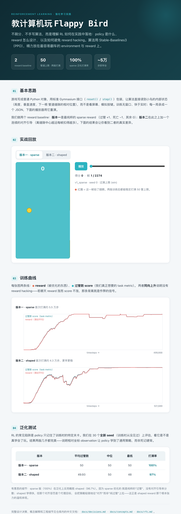

# flappy_rl

一个小巧、易读的项目，通过教计算机玩 Flappy Bird 来**理解 reinforcement learning（强化学习）**。
目标不是刷分，也不是手写算法——那部分依靠成熟的库（Stable-Baselines3）。目标是理解
*RL 在实践中落地的概念与工程*：policy 是什么、训练循环如何成形、如何设计 reward，
以及如何避免 **reward hacking**。

<p align="center">
  
</p>

<p align="center"><em>训练好的 policy（PPO）流畅过管——约 5 万步即学会，两版 reward 都能稳定打满 50 管上限。</em></p>

## 一段话设计

Flappy Bird 是现存最友好的 RL 问题之一：两个动作（flap / 不 flap）、一个用少数几个数字
就能描述的 state（bird 高度、垂直速度、下一个 pipe 缝隙的相对位置），以及清晰的进展概念
（活着、过 pipe）。我们把游戏写成普通 Python 对象，用标准的
[Gymnasium](https://gymnasium.farama.org/) `Env` 接口（`reset()` / `step()`）包装它，
让 [Stable-Baselines3](https://stable-baselines3.readthedocs.io/) 负责学习。算法直接读
小鸟的内部数值状态，而不是看屏幕、模拟按键。渲染是一条可选的、仅供人观看的旁路，与训练
完全解耦——训练期间没有窗口、没有实时时钟，快于实时地跑。

## 在线 Demo

GitHub Pages 上有一个交互页面：可切换两版 policy 的实战回放、看训练曲线、看泛化测试结果。

<p align="center">
  
</p>

## 两个 reward baseline

reward 是你唯一告诉 agent「什么叫玩得好」的地方，也是几乎所有 RL 痛苦的所在——agent
优化的是你确切写下的东西，不是你想表达的东西。我们做两个版本做对比：

| 版本 | reward 设计 | 首次打满 | 泛化打满率 | 特点 |
|---|---|---|---|---|
| **版本一 · sparse** | 过管 +1、死亡 −1、其余 0 | ~5.5 万步 | 100% | 最纯，学得稍慢、稍抖 |
| **版本二 · shaped** | sparse 之上叠加「离缝隙中心越远每帧扣得越多」 | ~4.3 万步 | 96.7% | 学得更早更稳，但对齐项是代理目标 |

两版的 reward 与 task metric（过管数）都同步上升，没有出现 reward hacking——这是一组干净
的对照基线。关于 reward 设计的陷阱清单、reward hacking 如何识别与防止，见
[`docs/concepts.md`](docs/concepts.md) 第 4 节。

## 文档导览

工作语言为中文。建议阅读顺序：

1. [`docs/concepts.md`](docs/concepts.md) —— RL 入门：policy、value、训练循环、DQN 与
   PPO，以及 **reward 设计 + reward hacking**（核心）。
2. [`docs/decisions.md`](docs/decisions.md) —— 所有设计决策的权威存档（observation、
   两版 reward、episode 终止、数值旋钮、回放/网页架构）。
3. [`docs/rfc.md`](docs/rfc.md) —— 架构与关键决策，包括*为什么是同步固定 timestep 循环
   而非「控制真实窗口」*。
4. [`docs/prd.md`](docs/prd.md) —— 目标、需求、成功标准。
5. [`docs/test.md`](docs/test.md) —— 每一层「已验证」意味着什么 + CI。

[`docs/working.md`](docs/working.md) 是持续的 changelog 和经验教训记录。

## 快速开始

```bash
# 用 uv 创建环境并安装
uv venv .venv && source .venv/bin/activate
uv pip install -e '.[dev]'

# 训练一版 baseline（产物落 runs/<label>/，已 gitignore）
python scripts/train.py --reward sparse --timesteps 500000 --label v1_sparse
python scripts/train.py --reward shaped --timesteps 500000 --label v2_shaped

# 在全新 seed 上做泛化评估
python scripts/evaluate.py --label v1_sparse --reward sparse --episodes 30

# 把一局回放渲染成 GIF
python scripts/render_gif.py docs/results/v1_sparse_ep0.json docs/assets/demo.gif

# 本地预览网页（GitHub Pages 同款）
python -m http.server -d docs 8000   # 然后访问 http://localhost:8000
```

测试：

```bash
PYTHONPATH=src python -m pytest tests/ -q   # 30 个测试，覆盖 physics/env/recorder/训练管线
```

## 项目结构

```
src/flappy_rl/     物理内核(game) / Gymnasium env(env) / 录制器 / 训练指标 / policy 回放
scripts/           train · evaluate · record_episode · render_gif（面向用户的入口）
tests/             分层测试（见 docs/test.md）
docs/              中文文档 + GitHub Pages（index.html / player.js / curves.js / results / assets）
```

## 隐私

本仓库被设计为可发布的。不含任何密钥、个人数据或私有路径。`.env.example` 用占位符记录了
一个可选的实验追踪集成。
